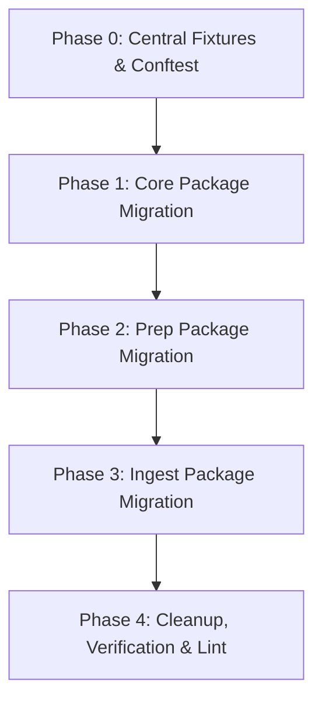

# Functional Requirements Document (FRD)

**Title:** Testing Framework Modernization: 1:1 Structural Parity, Behavior Audit & Acceptance Invariants  
**Status:** Approved for Implementation  
**Target Areas:** `tests/`, `etfportfolio/`  
**Author:** Quantitative Architecture & Engineering  
**Date:** September 2026  

---

## 1. Executive Summary & Context

The `etfportfolio` repository has matured across ingestion (IBKR Gateway, Web API session management, cold storage price archiving) and silver observations prep (decompression, metric and dimension extraction, watermark checkpointing). However, earlier rapid development resulted in significant structural drift and technical debt in the test suite:
1. **Flat & Disorganized Test Root:** `tests/` remained mostly flat with arbitrary naming (`test_session_and_series.py`, `test_observations_extractors.py`, `test_changelog_and_migration.py`), failing to match the modular package layout under `etfportfolio/` (`core/`, `ingest/`, `prep/`).
2. **Monolithic Test Files:** `tests/ingest/test_prices.py` grew to 933 lines, combining price math, database upsert/replacement, gateway connection error handling, pipeline orchestration, and cold-storage purging in a single file.
3. **Dead / Obsolete Assertions:** One-off migration script tests (e.g., `test_migrate_snapshots_changelog`) remained in continuous CI despite the migration having already settled in production.
4. **Under-tested Critical Core Modules:** Foundational packages like `core.config`, `core.db`, and `core.progress` lacked systematic unit/integration tests, while 32 realistic JSON payload fixtures in `tests/fixtures/` were underutilized.

This document serves as the authoritative, self-contained implementation specification for the testing framework modernization. It defines the exact 1:1 directory architecture, test isolation invariants, fixture helpers, module decomposition boundaries, quantitative tolerance rules, and phased execution rollout.

---

## 2. Architectural Principles & Governing Rules

All implementations under this initiative must strictly adhere to the project's governing principles from `AGENTS.md` and design interview agreements:

1. **Simplicity:** Clear, simple, testable, deterministic code. No hidden global state. No speculative abstractions or unnecessary test framework dependencies.
2. **1:1 Mirror Structural Parity (Strict):**
   Every non-`__init__.py` production file under `etfportfolio/<package>/<module>.py` must have an exact 1:1 mirror under `tests/<package>/test_<module>.py`. Even configuration, registry, or CLI modules (e.g. `endpoints.py`, `cli.py`, `progress.py`) must have a corresponding test module verifying contracts and invariants.
3. **Unified Single Test Files:**
   Each `test_<module>.py` file consolidates both pure unit assertions and fast in-memory DuckDB integration tests for that module. Do not create separate `_integration.py` files.
4. **Replacement Over Deprecation:**
   Delete tests asserting against obsolete fallback paths, dead error handling, or one-off legacy migration scripts. Test active, production-grade contracts and domain invariants only.
5. **Fast & Isolated Execution:**
   All tests must execute against in-memory DuckDB (`duckdb.connect(":memory:")`) or isolated temporary paths (`tmp_path`). The entire test suite must run in sub-3 seconds and must never make external network calls, launch browser processes, or mutate live `.env` or production database files.

---

## 3. Directory Layout Specification

The target testing tree mirrors the production repository 1:1:

```
etfportfolio/
├── core/
│   ├── config.py
│   ├── db.py
│   ├── logging.py
│   ├── progress.py
│   └── schema.sql
├── ingest/
│   ├── clean.py
│   ├── contracts.py
│   ├── details.py
│   ├── endpoints.py
│   ├── gateway.py
│   ├── landing.py
│   ├── pipeline.py
│   ├── prices.py
│   ├── products.py
│   ├── session.py
│   ├── snapshots.py
│   ├── themes.py
│   └── utils.py
└── prep/
    ├── cli.py
    ├── extractors.py
    ├── pipeline.py
    └── utils.py

tests/
├── conftest.py
├── fixtures/
│   ├── *.json (32 API payload fixtures)
├── core/
│   ├── test_config.py
│   ├── test_db.py
│   ├── test_logging.py
│   └── test_progress.py
├── ingest/
│   ├── test_clean.py
│   ├── test_contracts.py
│   ├── test_details.py
│   ├── test_endpoints.py
│   ├── test_gateway.py
│   ├── test_landing.py
│   ├── test_pipeline.py
│   ├── test_prices.py
│   ├── test_products.py
│   ├── test_session.py
│   ├── test_snapshots.py
│   ├── test_themes.py
│   └── test_utils.py
└── prep/
    ├── test_cli.py
    ├── test_extractors.py
    ├── test_pipeline.py
    └── test_utils.py
```

---

## 4. Root Test Configuration & Global Isolation (`tests/conftest.py`)

The root `tests/conftest.py` must provide global test isolation and reusable fixtures across all packages:

### 4.1 Global Environment Isolation (`autouse=True`)
An autouse fixture must guarantee that no test can accidentally access real user sessions, write to disk data directories, or launch real browser/network instances:
- `settings.account_id` set to `None` (or test dummy).
- `settings.session_state_path` pointed to `tmp_path / "test_session_state.json"`.
- `etfportfolio.ingest.session.login` mocked to prevent browser/Playwright execution.
- Any attempt to connect to an external IB Gateway via `gateway.ib_connection` defaults to an explicit mocked environment unless specifically testing gateway connection errors.

### 4.2 Centralized Fixture Helper (`load_fixture`)
A session-cached helper function or fixture `load_fixture(name: str) -> dict | list`:
- Resolves files portably against `Path(__file__).parent / "fixtures" / f"{name}.json"`.
- Deserializes via `orjson.loads` or `json.loads`.
- Raises descriptive `FileNotFoundError` if the fixture name is missing.

### 4.3 Database Fixtures
- `db_conn()`: Returns a fresh, in-memory DuckDB connection (`duckdb.connect(":memory:")`) initialized with `apply_schema(conn)`.
- `sample_product_id()`: Returns a standard test integer product ID (`8335` or `1001`) with a corresponding row pre-inserted into `bronze.products` and `bronze.contracts` when required.

---

## 5. Domain Invariants & Module Specifications

### 5.1 Package: `tests/core/`

#### 5.1.1 `test_config.py`
- Verify default values for all `Settings` attributes (`db_path`, `freshness_window_hours`, `details_concurrency`, `ib_gateway_host`, `ib_gateway_port`, `blocked_exchanges`).
- Verify reading configuration overrides from `pyproject.toml` under `[tool.etfportfolio]`.
- Verify environment variable overrides (`ETF_DB_PATH`, `ACCOUNT_ID`, etc.).

#### 5.1.2 `test_db.py`
- **Schema Idempotency:** Verify `apply_schema(conn)` succeeds on a blank database and is completely idempotent when executed multiple times consecutively without throwing table/sequence conflict errors.
- **Schema Verification:** Assert that all expected schemas (`bronze`, `silver`, `gold`, `cold_storage`) and sequences (`bronze.snapshots_id_seq`) are properly initialized.
- **`AsyncDbWorker` Invariants:**
  - Execute sync callables across worker threads via `await worker.submit(...)`.
  - Verify FIFO execution order for dependent writes.
  - Verify exception propagation: exceptions raised inside the submitted callable must be caught and raised to the calling awaiter.
  - Verify clean worker shutdown on `.stop()`.
- **`db_connection` Context Manager:** Verify read/write access and proper closure of DuckDB connections upon exiting context.

#### 5.1.3 `test_logging.py`
- Migrate existing tests from `tests/test_logging.py`.
- Verify `configure_logging(verbose=False)` mutes info diagnostics on stderr while writing to log file.
- Verify `configure_logging(verbose=True)` outputs info diagnostics to stderr.
- Verify suppression of noisy external loggers (Playwright, HTTPX, DuckDB).

#### 5.1.4 `test_progress.py`
- Verify `iter_progress` and `progress_bar` creation with custom descriptions.
- Verify `bars_disabled()` evaluates accurately when `sys.stderr.isatty()` is False or True.
- Verify `TqdmLoggingHandler` writes through `tqdm.write` without crashing or corrupting active bars.
- Verify progress bar advance, total tracking, and context exit cleanup.

---

### 5.2 Package: `tests/prep/`

#### 5.2.1 `test_utils.py`
- Migrate existing utility tests from `tests/test_observations_extractors.py` and `tests/test_utils.py`.
- Verify `parse_effective_date`: Unix millisecond timestamps, date strings (`YYYYMMDD`, `YYYY-MM-DD`, `YYYY/MM/DD`), zero/negative fallbacks, and returned source tag (`"payload"` vs `"snapshot"` vs `"item"`).
- Verify `clean_credit_rating`: Stripping prefixes (`"% Quality/BBB"` $\rightarrow$ `"BBB"`).
- Verify `sanitize_metric_id`: Converting human-readable metric labels to snake_case identifiers.
- Verify `parse_net_assets`: Handling currency symbols (`$`, `€`), scale suffixes (`B`, `M`, `K`), comma decimals (`2,5B`), and embedded dates (`"$78.63B (2026/07/31)"`).
- Verify `parse_manager_tenure`: Calculating fractional years relative to reference date (`365.25` days/year).
- Verify `parse_percentage`: Converting percent strings (`"0.32%"` $\rightarrow$ `0.0032`), bound values (`"<0.01%"` $\rightarrow$ `0.0001`), nulls, and error triggers on invalid strings.
- Verify `decompress_payload`: Validating Zstandard decompression of content-addressed blobs.

#### 5.2.2 `test_extractors.py`
- Migrate extractor tests from `tests/test_observations_extractors.py`.
- **Synthetic Unit Cases:** Keep existing focused unit assertions for `extract_ratios`, `extract_profile`, `extract_esg`, `extract_mstar`, `extract_lipper`, `extract_holdings`, and `extract_theme_weights`.
- **Real Payload Fixture Invariants:**
  - Parameterize tests across `tests/fixtures/<endpoint>_complete.json` and `tests/fixtures/<endpoint>_empty.json`.
  - Assert that calling each extractor with realistic complete fixtures produces valid `ExtractionResult` objects containing non-empty `metrics` and `dimensions` without throwing KeyError or ValueError.
  - Assert that calling each extractor with empty fixtures (`{}`) produces zero metrics and zero dimensions safely.

#### 5.2.3 `test_pipeline.py`
- Migrate tests from `tests/test_observations_pipeline.py`.
- Verify `run_observations` execution end-to-end against an in-memory DuckDB:
  - Correct ingestion of snapshots across all 7 endpoints.
  - Population of `silver.product_metrics` and `silver.product_dimensions`.
  - Population of `silver.processed_snapshots` watermark table.
- Verify idempotency: subsequent run with `force=False` processes 0 snapshots.
- Verify forced re-processing: run with `force=True` wipes and repopulates silver tables cleanly.
- Verify in-memory deduplication: when two snapshots have identical primary keys within the same processing batch, the observation with the later `fetched_at` wins without DuckDB constraint collisions.

#### 5.2.4 `test_cli.py`
- Verify `ObservationsCLI` (`ObservationsCLI.__call__`):
  - Mock `run_observations` and verify argument delegation for both `force=False` and `force=True`.
  - Verify console logs output start and completion messages.

---

### 5.3 Package: `tests/ingest/`

#### 5.3.1 `test_utils.py`
- Migrate `is_fresh` tests from `tests/test_utils.py` (None checks, 24h window, naive vs UTC datetimes, future-skew clamping).
- Migrate `content_address` & `canonical_bytes` determinism tests (dictionary key sorting, list canonical sorting, unsigned 64-bit xxhash).
- Migrate `store_blob` and `gc_preview_blob` tests (verifying orphan blob deletion and retention when referenced in `snapshot_previews` or `snapshots`).

#### 5.3.2 `test_products.py`
- Migrate tests from `tests/test_products.py`.
- Verify `resolve_target_products`:
  - Empty `bronze.contracts` raises `RuntimeError`.
  - Exchange filtering: filters out products whose `primary_exchange_id` or fallback `exchange_id` matches `settings.blocked_exchanges`.
  - Fallback exchange handling (allowed exchange, null primary exchange).
  - All-blocked logging and empty list return.

#### 5.3.3 `test_contracts.py`
- Migrate tests from `tests/test_contracts.py`.
- Verify `_clean_val` string stripping and null-normalization.
- Verify `_flatten_contract_details` converting empty strings from `ib_async.ContractDetails` to `None`.
- Verify `upsert_contract` stores `None` as DuckDB `NULL` in `bronze.contracts` with zero empty string pollution.

#### 5.3.4 `test_session.py`
- Migrate session tests from `tests/test_session_and_series.py`.
- Verify `fetch_with_retry`:
  - HTTP 404 is returned immediately as `(404, None)` with zero retries.
  - HTTP 200 returns status and payload dict.
  - HTTP 500 / timeouts retry up to `max_retries` before raising or returning error.
- Verify `reconcile_account_id`:
  - Matching account ID returns `True` without rewriting `.env`.
  - Mismatched or new account ID updates `.env` file cleanly.

#### 5.3.5 `test_snapshots.py`
- Migrate `test_store_snapshot_changelog` from `tests/test_changelog_and_migration.py`.
- Prune `test_migrate_snapshots_changelog` per **Replacement Over Deprecation**.
- Verify `store_snapshot`:
  - Initial insert: creates new record with `created_at = last_checked_at = t1`.
  - Unchanged payload at `t2`: updates existing record in-place (`created_at = t1`, `last_checked_at = t2`), does NOT insert new row.
  - Changed payload at `t3`: inserts new record with new `snapshot_id`, `created_at = t3`, `last_checked_at = t3`.
- Verify transactional rollback: DuckDB write failures during snapshot or blob storage trigger `ROLLBACK` and raise exception.
- Verify `fetch_snapshot`: HTTP 404 response stored as `{}` payload so `last_checked_at` is stamped.

#### 5.3.6 `test_landing.py`
- Verify `fetch_and_gate`:
  - Resolves landing URL, fetches payload, content-addresses it, and checks against `bronze.snapshot_previews`.
  - Returns `changed=True` when product is new or hash has changed; returns `changed=False` when hash is identical.
  - 404 response content-addresses as `{}`.
- Verify `_commit_preview`:
  - Upserts preview hash into `bronze.snapshot_previews`.
  - Sets `updated_at` only when hash differs from previous preview.
  - Calls `gc_preview_blob` to purge the replaced blob if the hash changed.
- Verify `_stamp_last_checked`: updates `last_checked_at` without modifying `hash` or `updated_at`.
- Verify landing stamp rule: last_checked_at is stamped if and only if `not (fetch_gated and not gated_success)`.

#### 5.3.7 `test_details.py`
- Verify `load_landing_freshness_cache` and `load_endpoint_freshness_cache`.
- Verify `process_product` orchestration under mocked network responses:
  - Skips product entirely if landing snapshot preview is fresh within `freshness_window_hours`.
  - If landing preview changed, proceeds to gated endpoints.
  - Skips individual endpoints that are fresh in `bronze.snapshots`.
  - Updates landing cache and endpoint caches accurately.

#### 5.3.8 `test_endpoints.py`
- Verify `Endpoint` data structure and registry:
  - All 8 expected endpoints exist in `ENDPOINTS_BY_NAME` (`landing`, `profile`, `ratios`, `holdings`, `mstar`, `esg`, `themes`, `theme_weights`).
  - URL formatting and token interpolation (`account_id`, `product_id`) in `.resolve()`.
  - Classification of gated vs. ungated endpoints.

#### 5.3.9 `test_themes.py`
- Test `upsert_themes` and theme hierarchy:
  - Upserting parent themes first, then node themes into `bronze.themes`.
  - Timestamp updates on `last_checked_at`.
- Test `sync`:
  - Skips network fetch if themes were checked within `freshness_window_hours` (unless `force=True`).
  - Fetches and updates theme taxonomy under mocked HTTP response.

#### 5.3.10 `test_gateway.py`
- Decomposed from `tests/ingest/test_prices.py`.
- Verify `ib_connection` context manager:
  - Connects with specified `clientId` and config settings.
  - Automatically disconnects on context exit.
  - Raises `IBConnectionError` on `ConnectionRefusedError` with troubleshooting instructions.
  - Raises `IBConnectionError` on `TimeoutError`.
  - Reconciles managed account ID when returned by gateway.

#### 5.3.11 `test_prices.py` (Quantitative Invariant Test Suite)
Decomposed from `tests/ingest/test_prices.py` (933 lines $\rightarrow$ focused domain test module). All tests must explicitly validate the active mathematical and operational invariants:

1. **Duration Formatting Invariant (`format_duration`):**
   - Minimum `"10 D"` for $\le 10$ days.
   - Days representation `"X D"` for $11 \le X \le 365$.
   - Year representation `"Y Y"` ($\text{ceil}(X / 365.25)$) for $X > 365$.
   - Capped at `"30 Y"`.
2. **Overlap Window Invariant (`overlap_start_for` & `validate_overlap`):**
   - Calendar overlap window is closed-closed $[t_{\text{last}} - 14\text{d}, t_{\text{last}}]$ ($\sim 10$ trading bars).
   - Bars strictly outside the window are ignored.
3. **Settlement Envelope Tolerance Invariant:**
   - On the most recent 4–5 trading days ($d \ge t_{\text{last}} - 5\text{d}$), after-market settlement adjustments are accepted if difference $\le \$0.10$ or relative error $\le 1\%$ (`PRICE_ABS_TOL = 0.10`, `PRICE_REL_TOL = 0.01`). Returns `(True, None)`.
4. **Corporate Action Split Detection Invariant (`uniform_ratio_test`):**
   - If historical bars ($d < t_{\text{last}} - 4\text{d}$) deviate beyond tolerance, calculate ratio sequence $R_i = \text{new}_i / \text{existing}_i$.
   - If $\text{std}(R) \le 10^{-3}$, classify as stock split / corporate action (`mismatch_type = 'corporate_action'`).
5. **Anti-Truncation Retention Guard Invariant (`MIN_REFETCH_RETENTION_RATIO = 0.90`):**
   - When a full refetch occurs, the new series must contain at least $90\%$ of the existing bar count.
   - If new bars $< 0.90 \times \text{existing bars}$, refetch is rejected, existing bars are retained, and status is flagged as `"error"`.
6. **Replace Series & Cold Storage Invariant (`replace_series`):**
   - Valid corporate actions archive the previous price series into `cold_storage.prices` with `reason='corporate_action'` before updating `bronze.prices`.
   - `replace_series(archive=False)` overwrites `bronze.prices` directly without archiving.
7. **Series Status Invariant (`PriceSeriesStatus`):**
   - Differentiated freshness: `"ok"` or `"no_data"` within `freshness_window_hours` is fresh; `"error"` or stale timestamps require refetch.
   - Long error message strings are truncated to 500 characters when recorded in `bronze.price_status`.

#### 5.3.12 `test_clean.py`
- Verify `clean_cold_storage`:
  - Deletes redundant archived runs where all historical bars older than 5 trading days match `bronze.prices` within tolerance.
  - Retains genuine corporate action archives where historical bars differ.
- Verify `clean_payload_blobs`:
  - Deletes unreferenced orphan blobs in `bronze.payload_blobs`.
  - Retains blobs referenced in `bronze.snapshots` or `bronze.snapshot_previews`.
- Verify `run_clean` CLI wrapper runs checkpoint vacuum without error.

#### 5.3.13 `test_pipeline.py`
- Decomposed from `tests/ingest/test_prices.py` and old pipeline tests.
- Verify `Ingest` orchestration interface:
  - `Ingest.contracts(...)`: mocks contract resolution and upserting.
  - `Ingest.details(...)`: mocks product details worker and verifies concurrency flags.
  - `Ingest.prices(...)`: mocks `_run_price_ingestion` and verifies date filters, product selection, and dry-run flags.
  - Pipeline error handling and graceful database worker shutdown.

---

## 6. Migration Phasing & Execution Plan

The refactoring will be executed package-by-package. Each phase must leave the entire test suite green (`pytest` 100% passing) and formatted (`ruff check` & `ruff format` clean).



### Phase 0: Test Environment & Root Fixtures
1. Create `tests/conftest.py` with `isolate_test_environment` autouse fixture, `load_fixture` helper, and in-memory `db_conn`.
2. Verify all existing tests run and pass without modification.

### Phase 1: `core/` Migration
1. Create directory `tests/core/`.
2. Move `tests/test_logging.py` $\rightarrow$ `tests/core/test_logging.py`.
3. Implement `tests/core/test_config.py`.
4. Implement `tests/core/test_db.py` (schema application, `AsyncDbWorker`, exception handling).
5. Implement `tests/core/test_progress.py`.
6. Run `pytest tests/core/` and verify pass.

### Phase 2: `prep/` Migration
1. Create directory `tests/prep/`.
2. Split `tests/test_observations_extractors.py` into:
   - `tests/prep/test_utils.py` (parsing utilities, clean functions).
   - `tests/prep/test_extractors.py` (synthetic unit tests + JSON fixture validation).
3. Move `tests/test_observations_pipeline.py` $\rightarrow$ `tests/prep/test_pipeline.py`.
4. Implement `tests/prep/test_cli.py` (smoke/contract test for `ObservationsCLI`).
5. Delete old `tests/test_observations_extractors.py` and `tests/test_observations_pipeline.py`.
6. Run `pytest tests/prep/` and verify pass.

### Phase 3: `ingest/` Migration & Decomposition
1. Ensure directory `tests/ingest/` exists.
2. Move `tests/test_contracts.py` $\rightarrow$ `tests/ingest/test_contracts.py`.
3. Move `tests/test_products.py` $\rightarrow$ `tests/ingest/test_products.py`.
4. Split `tests/test_utils.py` $\rightarrow$ `tests/ingest/test_utils.py` (ingest utils like content addressing, blob GC).
5. Split `tests/test_session_and_series.py`:
   - Session & fetch tests $\rightarrow$ `tests/ingest/test_session.py`.
   - Series status tests $\rightarrow$ `tests/ingest/test_prices.py`.
6. Split `tests/test_changelog_and_migration.py`:
   - `test_store_snapshot_changelog` $\rightarrow$ `tests/ingest/test_snapshots.py`.
   - Prune `test_migrate_snapshots_changelog`.
7. Implement `tests/ingest/test_landing.py` and `tests/ingest/test_details.py`.
8. Implement `tests/ingest/test_endpoints.py` and `tests/ingest/test_themes.py`.
9. Decompose `tests/ingest/test_prices.py`:
   - Extract IB connection / retry tests $\rightarrow$ `tests/ingest/test_gateway.py`.
   - Extract orchestration / CLI tests $\rightarrow$ `tests/ingest/test_pipeline.py`.
   - Retain mathematical, tolerance, overlap, corporate action, and DuckDB series operations in `tests/ingest/test_prices.py`.
10. Ensure `tests/ingest/test_clean.py` remains focused on cold storage & blob purging.
11. Delete obsolete root test files (`test_contracts.py`, `test_products.py`, `test_utils.py`, `test_session_and_series.py`, `test_changelog_and_migration.py`).

### Phase 4: Verification, Lint & Audit
1. Run full test suite via `.venv/bin/pytest`. All tests must pass in $<3.0$ seconds.
2. Verify exact 1:1 structural correspondence between `etfportfolio/` and `tests/`.
3. Run `.venv/bin/ruff check .` and `.venv/bin/ruff format .`.
4. Confirm zero deprecation warnings or dead code.

---

## 7. Acceptance Criteria

A successful implementation satisfies all of the following:

- [ ] **Structural Parity:** Every python file in `etfportfolio/<pkg>/<mod>.py` (except `__init__.py`) has a corresponding test in `tests/<pkg>/test_<mod>.py`.
- [ ] **Root Cleanliness:** No loose test scripts remain directly under `tests/` (only `conftest.py` and `fixtures/`).
- [ ] **Fast Execution:** Full test suite executes cleanly in under 3.0 seconds on standard developer machines.
- [ ] **Isolation Guarantee:** Zero external network calls, zero browser processes launched, zero mutations to live `.env` or data directory state files.
- [ ] **Behavioral Invariant Coverage:** All six core quantitative price invariants (overlap window, settlement envelope tolerance, uniform ratio split detection, corporate action archiving, 90% retention guard, cold storage redundancy cleanup) are covered by explicit, passing tests.
- [ ] **Fixture Hygiene:** The 32 JSON fixtures in `tests/fixtures/` are portably resolvable and validated against their extractors.
- [ ] **Code Quality:** `ruff check` passes with zero lint or formatting errors.
